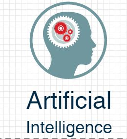
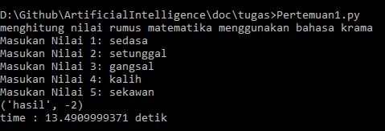

**Latar Belakang**

Kecerdasan buatan merupakan kecerdasan yang diciptakan dan dimasukkan ke dalam suatu mesin (komputer) agar dapat melakukan pekerjaan seperti yang dapat dilakukan manusia. Kecerdasan buatan ini juga dapat membuat dan merekayasa mesin (komputer) agar dapat melakukan pekerjaan yang mampu cepat dan tepat. Cepat artinya melakukan segala sesuatu dengan waktu yang singkat dan tepat artinya melakukan segala sesuatu dengan benar.

**Penjelasan**

Tujuan kecerdasan buatan yaitu:

1. Untuk mengembangkan metode dan sistem untuk menyelesaikan masalah,masalah yang biasa diselesaikan melalui aktifivitas intelektual manusia.

2. Untuk meningkatkan pengertian/pemahaman kita pada bagaimana otak manusia bekerja

Contoh Penerapan kcerdasan buatan dalam kehidupan yaitu bermain Game. Game biasanya memiliki karakter yang dikontrol oleh user, dan karakter lawan yang dikontrol oleh game itu sendiri. Dimana kita harus merancang aturan-aturan yang nantinya akan dikerjakan oleh karakter lawan. Game akan menjadi menarik apabila karakter lawan (non-player) bereaksi dengan baik terhadap apa yang dilakukan oleh player. Hal ini akan memancing penasaran user dan membuat game menarik untuk dimainkan. Tujuan intinya adalah membuat non-player memiliki strategi yang cerdas untuk mengalahkan player. Pada bidang ini,  AI dibutuhkan, yaitu untuk merancang dan menghasilkan game yang fun serta antarmuka antara man-machine yang cerdas dan menarik untuk dimainkan.

contoh hasil implementasi :

**Kesimpulan**

Dari penjelasan diatas dapat disimpulkan bahwa kecerdasan buatan dapat direkayasa agar dapat mengerjakan pekerjaan layaknya manusia serta dapat melakukan pekerjaan secara cepat dan tepat.

**Saran**

Kercerdasan buatan ini merupakan mata kuliah yang dapat membantu kita dalam mengerjakan sesuatu secara maksimal jika kita mempelajarinya dengan sungguh-sungguh.
