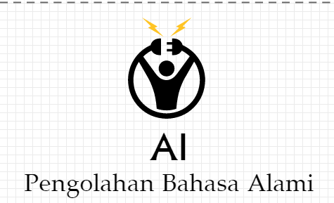
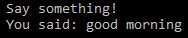

Latar Belakang Masalah

1. Pengolahan Bahasa Alami
2. Bidang Pengetahuan
3. Pengenalan Suara ( Speesch Recognition )

Pembahasan

1. Pengolahan Bahasa Alami (Natural Language Processing )

Merupakan salah satu bidang ilmu komputer, kecerdasan buatan dan bahasa yang berkaitan dengan berinteraksi dengan komputer menggunakan bahasa keseharian kita ( bahasa Indonesia maupun bahasa Inggris ). Tujuanya yaitu agar mesin mengerti dan memahami bahasa manusia  dan memberikan respon yang sesuai.

1. Bidang Pengetahuan

Bidang pengetahuan dalam pengolahan bahasa alami mempunyai beberapa tahapan, yaitu:

- --Fonetik dan Fonologi yaitu berhubungan dengan deteksi suara menjadi kata.

Contohnya : Siri, Google Assistant

- --Morfologi yaitu pembentukan kata dari kata dasar.

Contohnya: Menyanyi = Me – Nyanyi

- --Sintaksis yaitu pembagian atau pembuatan aturan baku sebuah kalimat.

Contoh : Ibu pergike pasar

                  S            P         K

- --Semantik yaitu arti kata sesungguhnya atau paling dasar. Definisi dari sebuah kata, makna dari kata.

Contoh : Kutu Buku

- --Pragmatik yaitu Orientasi tujuan dan situasi.
- --Discourse Knowledge yaitu kalimat yang sebelumnya akan mempengaruhi kalimat yang selanjutnya.
- --Word Knowledge yaitu mencakup arti kata secara umum.

1. Speech Recognition

Merupakan pengenalan suara dengan library phyton dengan dukungan API dan beberapa mesin. Yang dibutuhkan sebelum menginstall Speech Recognition yaitu:

- --Install PyAudio yang digunakan untuk menginput microphone
- --Install PocketSphinx untuk sphinx recognizer
- --Install Goog;e API Client Library for Python untuk menggunakan Google loud Speech
- --Dan yang terakhir install SpeechRecognition.
- --Dibawah ini adalah hasil contoh programnya:

Blog : https://wiwilutfiasih.wordpress.com/?p=447
