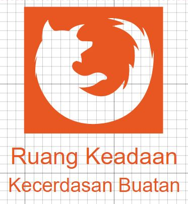

**Latar Belakang**

Dalam kecerdasan masalah terdapat sebuah masalah, kemudian masalah tersebut didefinisikan kedalam ruang keadaan meliputi keadaan awal, aturan dan tujuan atau keadaan akhir.

**Pembahasan**

Ruang keadaan merupakan ruang yang berisi semua keadaan yang mungkin untuk mendeskripsikan sebuah masalah dengan baik. Cara mendeskripsikannya yaitu:

1. Mendefiisikan ruang keadaan
2. Menetapkan satu atau lebih keadaan awal
3. Menetapkan satu atau lebih tujuan
4. Menetapkan kumpulan aturan

Contoh:

Seorang petani mempunyai sayuran, kambing dan serigala. Petani tersebut ingin memindahkan sayuran, kambing dan serigala dengan perahu ke pulau seberang. Namun petani harus membawanya satu persatu karena perahu yang ia milki tidak cukup untuk menampung semuanya. Jika petani membawa serigala, maka sayuran akan dimakan kambing. Jika petani membawa sayuran maka kambing akan dimakan serigala.

Penyelesaian:

Permasalahan ini dapat dilambangkan dengan (jumlah kambing,jumlah serigala,jumlah sayuran,jumlah perahu).

Contoh : daerah asal (0,1,1,1) = daerah asal tidak ada kambing,ada serigala, ada sayuran, ada perahu.

Keadaan awal, pada kedua daerah :

daerah asal = (1,1,1,1)

daerah seberang = (0,0,0,0)

Keadaan tujuan, pada kedua daerah :

daerah asal = (0,0,0,0)

daerah seberang = (1,1,1,1)

Aturan:

1. Kambing menyebrang
2. Sayuran menyebrang
3. Serigala menyebrang
4. Kambing kembali
5. Sayuran kembali
6. Serigala kembali
7. Petani kembali

Solusi:

Hasil program:

Kesimpulan:

Ruang keadaan merupakan ruang atau keadaan yang berisi segala kemungkinan yang terjadi

Saran:

Perlu diadakan praktek dan mempelajari ruang keadaan dari berbagai sumber.
